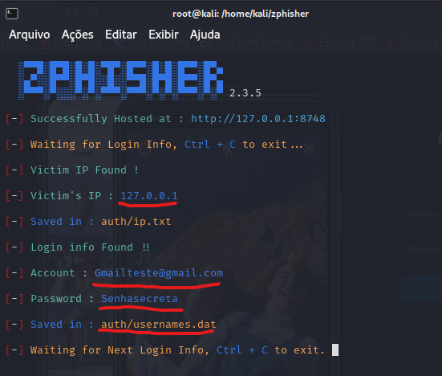
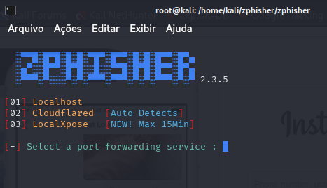
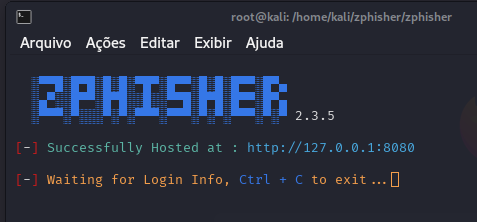

# Phishing para captura de senhas

### Ferramentas

- Kali Linux
- Zphisher

### Configurando o Phishing no Kali Linux

- Acesso root: ``` sudo su ```
- Clonando o repositório: ``` git clone --depth=1 https://github.com/htr-tech/zphisher.git ```
- Mudando para o diretório (zphisher): ``` cd zphisher ```
- Inicia a ferramenta: ``` bash zphisher.sh ```
- Escolha a página a ser clonada de sua preferência através dos números:

  

- Escolha rodar em localhost, cloudflare ou localXpose:

  

- Escolha a porta que deseja rodar a ferramenta caso queira e pronto, a ferramenta está rodando.
  
  
  

### Resutados:
  
  
  

## Por que escolhi esta ferramenta?

- **Amigável para iniciantes**: Interface simples e fácil de usar.
- **Várias opções de hosteamento**: Suporte a Cloudflared, LocalXpose e localhost.
- **Suporte a mascaramento de URL**: Aprenda como links podem ser disfarçados.
- **Compatível com Docker**: Configuração rápida e consistente.
